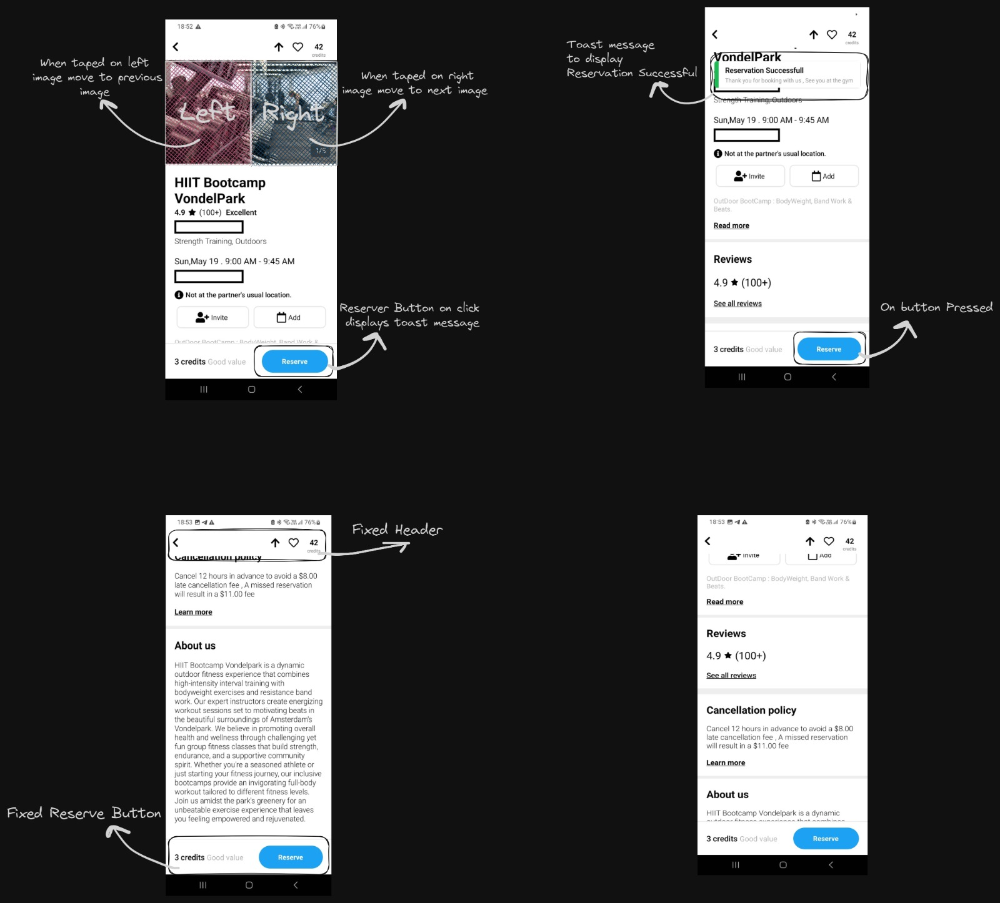
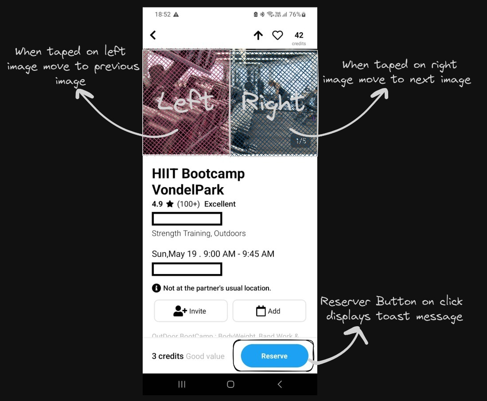
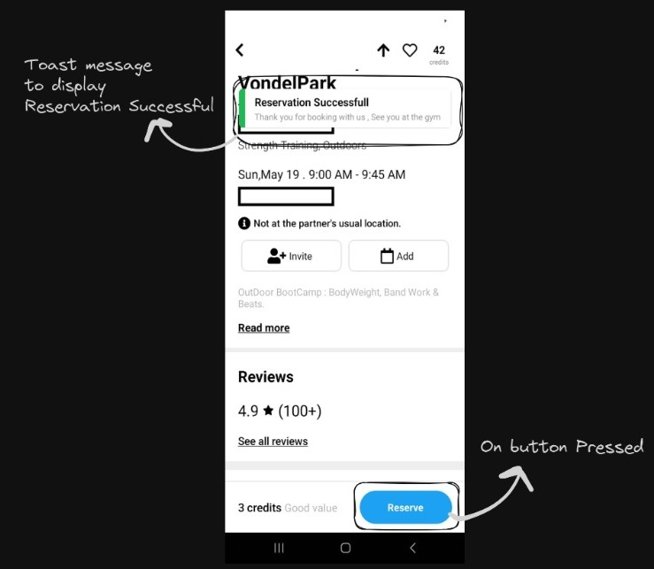
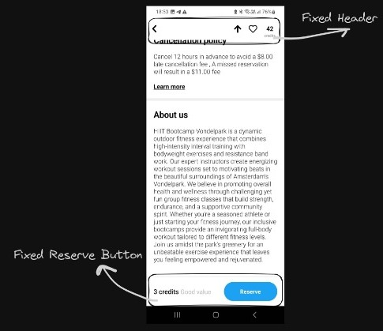

# Gym trainer react native ui app 
## Get started

1. Install dependencies

   ```bash
   npm install
   ```

2. Start the app

   ```bash
    npx start
   ```
3. Run the app on android

   ```bash
    npx react-native run-android
   ```
4. Run the app on ios

   ```bash
    npx react-native run-ios
   ```
5. Run the app on web

   ```bash
    npx react-native run-web
   ```
6. Run the app on windows

   ```bash
    npx react-native run-windows
   ```

## Screenshots
1. Demo Video
   [Video Title](https://drive.google.com/file/d/1kPTOW8J65DoG5DcG3JGKuWWznw1h0Bob/view?usp=sharing)

2. Complete Ui Scene
   

3. ImageSlider
   

4. Toast Message
   

5. Fixed Header NavBar
   

6. Toast Message
   
